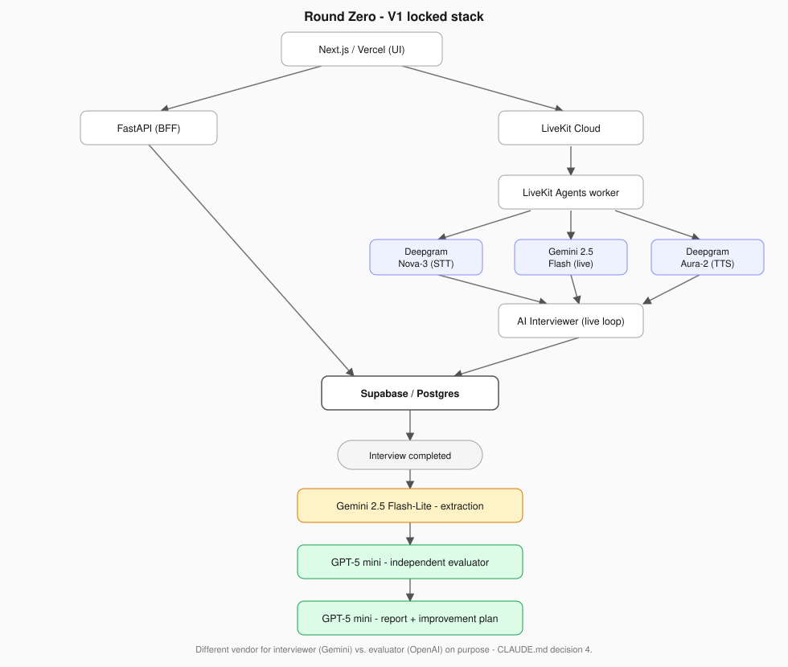

# Round Zero

AI-powered full-loop interview simulator for Staff/Principal ML & AI engineering roles. Candidates get a realistic, adaptive multi-round loop, evidence-backed feedback, and a prioritized improvement plan instead of a single generic mock interview.

Start here:
- `CLAUDE.md` - architecture decisions and working conventions
- `docs/PRD.md` - full product & technical requirements
- `specs/` - spec-driven development: what's being built and why, one folder per feature
- `.claude/skills/` - repeatable build procedures

## Status

The ML System Design vertical slice is built and running end-to-end: login -> setup
-> adaptive interview -> submit -> evaluated report -> history
(`specs/001-ml-system-design-vertical-slice/`). Other round types are a mocked shell
(setup screen + Loop Planner preview) - not built yet.

## Locked V1 stack

Every provider has a live/real implementation (`src/roundzero/llm/providers/`) that
falls back to a mock/rule-based path with no key set, so local dev works with zero
API keys - see `.env.example` for what each one unlocks. Voice (LiveKit + Deepgram)
is locked as the target stack but not wired into the app yet - see
`specs/001-ml-system-design-vertical-slice/milestone-4.md`.
